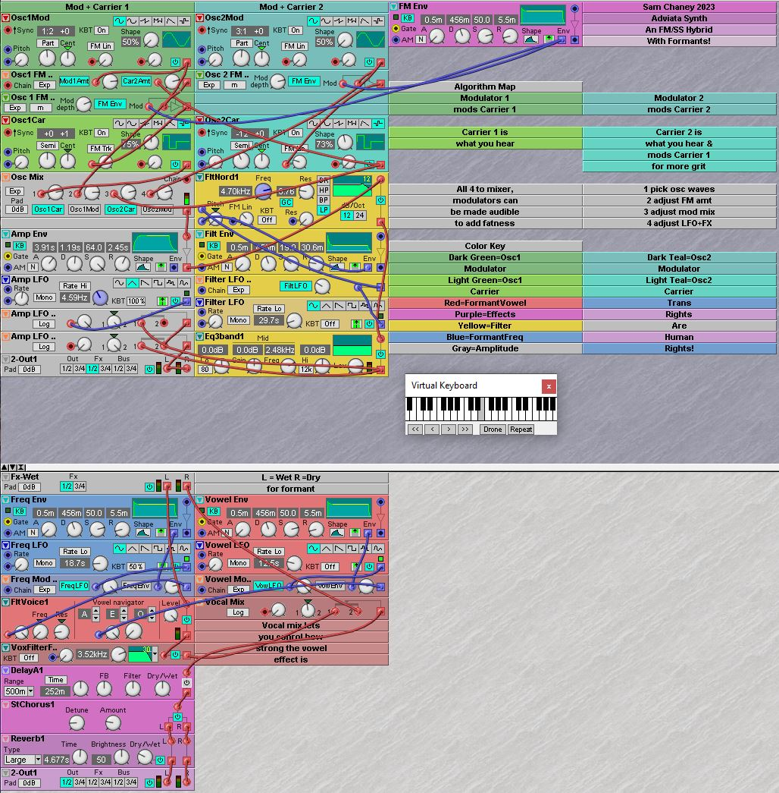

# Adviata-Synthesizer
Adviata is a Nord Modular G2 synthesizer patch that fuses frequency modulation with subtractive synthesis and adds formant filters, with LFOs and envelopes galore. You can craft the most cosmic, alien, mystical and powerful sounds you can imagine. Embrace the nonduality of fused synthesis!

